<!-- SPDX-FileCopyrightText: Copyright (c) 2026 NVIDIA CORPORATION & AFFILIATES. All rights reserved. -->
<!-- SPDX-License-Identifier: Apache-2.0 -->

# Specification: Hybrid Scenario E2E Architecture

## Overview & Objectives

The current scenario-based E2E framework is partway through a migration from one-off shell scripts to declarative scenario metadata. It already introduced useful concepts — base scenarios, onboarding profiles, test plans, expected states, onboarding assertions, validation suites, reports, and workflow dispatch — but the current YAML-first scenario model is starting to overload YAML with two different responsibilities:

1. **Product-facing desired setup/onboarding state** that should remain durable, backup/update-friendly, and eventually useful for materializing a real NemoClaw instance.
2. **E2E test scenario composition** such as matrix rules, assertion group selection, targeted scenario IDs, and framework-only execution behavior.

This spec converts the existing scenario-based suite to a hybrid architecture:

- **Onboarding configuration YAML** describes desired NemoClaw setup/onboarding state only. It is not the E2E scenario definition.
- **Deterministic typed scenario builders** define E2E scenario IDs, environment/onboarding combinations, matrix rules, and assertion group composition.
- **Assertion modules** are logical reusable groups in code, not YAML. They organize the assertions currently scattered across onboarding assertions, validation suites, domain helper scripts, and scenario metadata.
- **Assertion steps** are the smallest operation with its own E2E timeout/retry policy. A broad assertion group may contain multiple steps so reliability behavior is attached to the operation that can actually hang or transiently fail.
- **A plan compiler** combines a selected scenario builder with onboarding configuration YAML and assertion modules, then prints a `--plan-only` preview and produces an executable run plan.
- **Phase orchestrators** own phase-local actions, observations, assertions, lightweight retry/timeout enforcement, and phase results: Environment, Onboarding, and Runtime.
- **Shared E2E clients/adapters** wrap real NemoClaw system boundaries for reusable act/observe primitives.

All current scenario-based tests must go through this architecture as the only supported pattern. Existing YAML-first scenario metadata, suite metadata, compatibility aliases, and legacy entrypoints should be deleted or replaced once their coverage is represented in typed builders, manifests, and assertion modules. This is not a partial replacement for only the happy path.

## Current State Analysis

### Current files and responsibilities

Current scenario-based E2E files live under `test/e2e/`:

| Area | Current files | Current responsibility |
|---|---|---|
| Scenario metadata | `test/e2e/nemoclaw_scenarios/scenarios.yaml` | Platforms, installs, runtimes, setup scenarios, base scenarios, onboarding profiles, test plans, onboarding assertions |
| Expected state contracts | `test/e2e/nemoclaw_scenarios/expected-states.yaml` | Structural post-setup contracts for CLI/gateway/sandbox/inference/credentials/security/failure states |
| Setup adapters | `test/e2e/nemoclaw_scenarios/install/*.sh`, `onboard/*.sh` | Install and onboarding dispatch from YAML-resolved plan fields |
| Context emission | `test/e2e/nemoclaw_scenarios/helpers/emit-context-from-plan.sh` | Converts `plan.json` into `.e2e/context.env` |
| Runtime entrypoints | `test/e2e/runtime/run-scenario.sh`, `run-suites.sh`, `coverage-report.sh` | Plan resolution, install/onboard orchestration, optional expected-state validation, suite execution, report rendering |
| Resolver | `test/e2e/runtime/resolver/*.ts` | YAML loading, schema typing, plan resolution, expected-state validation, coverage reporting |
| Runtime helpers | `test/e2e/runtime/lib/*.sh` | env/context/logging/cleanup/artifact/sandbox teardown helpers |
| Onboarding assertions | `test/e2e/onboarding_assertions/**` | Phase-like install/preflight checks selected from YAML |
| Validation suites | `test/e2e/validation_suites/**` | Post-onboarding suite definitions and shell assertion steps selected from YAML |
| Scenario tests | `test/e2e/scenario-framework-tests/*.test.ts` | Schema, resolver, suite runner, coverage, docs, convention, parity, and helper tests |
| Workflows | `.github/workflows/e2e-scenarios.yaml`, `.github/workflows/e2e-parity-compare.yaml` | Manual scenario dispatch, WSL/macOS routing, parity/coverage comparison |
| Docs | `test/e2e/docs/README.md`, `MIGRATION.md`, `parity-map.yaml`, `parity-inventory.generated.json` | User/maintainer docs, migration tracking, parity inventory/mapping |

### Current scenario inventory that must be converted

Current `test/e2e/nemoclaw_scenarios/scenarios.yaml` contains:

- 7 existing `setup_scenarios` entries to replace:
  - `ubuntu-repo-cloud-openclaw`
  - `ubuntu-repo-cloud-hermes`
  - `gpu-repo-local-ollama-openclaw`
  - `macos-repo-cloud-openclaw`
  - `wsl-repo-cloud-openclaw`
  - `brev-launchable-cloud-openclaw`
  - `ubuntu-no-docker-preflight-negative`
- 6 `base_scenarios`:
  - `ubuntu-repo-docker`
  - `gpu-repo-docker-cdi`
  - `macos-repo-docker`
  - `wsl-repo-docker`
  - `brev-launchable-remote`
  - `ubuntu-repo-no-docker`
- 15 `onboarding_profiles`, including OpenClaw/Hermes, cloud/local/Ollama/OpenAI-compatible, messaging variants, Brave, resume/repair/double-onboard/token-rotation lifecycle variants.
- 19 `test_plans`, including the 7 alias targets plus additional onboarding/profile variants.
- 3 current `onboarding_assertions`:
  - `base-installed`
  - `preflight-passed`
  - `preflight-expected-failed`

All of these must be represented directly in the new architecture; the YAML-first scenario resolver is removed rather than maintained as a compatibility path.

### Current suite inventory that must be converted

Current `test/e2e/validation_suites/suites.yaml` includes implemented and alias-like suite families:

- Implemented concrete suites:
  - `smoke`
  - `inference`
  - `credentials`
  - `local-ollama-inference`
  - `ollama-proxy`
  - `platform-macos`
  - `platform-wsl`
  - `hermes-specific`
- Existing suite-family aliases or placeholders that must be converted into real assertion modules and wired into at least one canonical scenario plan:
  - `gateway-health`
  - `sandbox-shell`
  - `cloud-inference`
  - `ollama-auth-proxy`
  - `security-credentials`
  - `messaging-telegram`
  - `messaging-discord`
  - `messaging-slack`
  - `security-shields`
  - `inference-routing`
  - `sandbox-lifecycle`
  - `sandbox-operations`
  - `snapshot`
  - `rebuild`
  - `upgrade`
  - `diagnostics`
  - `docs-validation`
  - `openai-compatible-inference`
  - `inference-switch`
  - `kimi-compatibility`
  - `messaging-token-rotation`
  - `security-policy`
  - `security-injection`

All concrete scripts currently under `test/e2e/validation_suites/**` and `test/e2e/onboarding_assertions/**` must be reachable through assertion modules in the new design. No current validation suite key may be dropped during this architecture conversion; if a suite is currently only an alias or placeholder, the migration must turn it into a real assertion group with at least one assertion step and at least one canonical scenario that uses it.

### Current pain points

1. **YAML is doing too much.** The current YAML contains product-ish setup/onboarding state, E2E scenario identity, test-plan matrix composition, suite selection, assertion selection, expected state, runner requirements, skips, and lifecycle variants.
2. **Resolver complexity is growing around string references.** `resolver/plan.ts` behaves like a compiler for YAML references and compatibility checks. This logic is better expressed as typed scenario composition.
3. **Assertions are split across three concepts.** Current assertions exist as onboarding assertions, expected-state probes, and validation suites. The new architecture should retain phase ownership while grouping assertions by logical domain in code.
4. **Retry and timeout behavior is scattered.** Recent flake fixes added useful local handling for empty chat-event captures, live inference 5xx/timeouts, model/tool-call flakes, Cloudflare tunnel flakes, and wrong installed refs, but the suite has no simple way to see which E2E step owns a retry or timeout.
5. **Plan review is coupled to YAML structure.** Maintainers need to see the final expanded plan before execution, but that does not require assertion-plan YAML. It can be generated from deterministic builders.
6. **Future backup/update goals need a clean manifest.** Setup/onboarding YAML should be viable as a product-facing `NemoClawInstance` manifest, not polluted with E2E-only assertion composition.
7. **Workflow targeting must remain simple.** GitHub Actions must continue to run one or more targeted scenario IDs, with optional filtering, without requiring users to understand internal builder code.

## Architecture Design

### Target architecture diagram

```mermaid
%%{init: {"flowchart": {"htmlLabels": true, "nodeSpacing": 70, "rankSpacing": 95, "curve": "basis"}}}%%
flowchart LR
  classDef yaml fill:#f8fafc,stroke:#475569,stroke-width:2px,color:#0f172a
  classDef builder fill:#eef8e8,stroke:#76B900,stroke-width:3px,color:#10220a
  classDef module fill:#eff6ff,stroke:#2563eb,stroke-width:2px,color:#102040
  classDef orch fill:#f0fdf4,stroke:#16a34a,stroke-width:2px,color:#052e16
  classDef client fill:#f5f3ff,stroke:#7c3aed,stroke-width:2px,color:#24103f
  classDef sut fill:#fff7ed,stroke:#ea580c,stroke-width:2px,color:#431407
  classDef state fill:#ecfeff,stroke:#0891b2,stroke-width:2px,color:#083344
  classDef output fill:#dcfce7,stroke:#15803d,stroke-width:3px,color:#052e16
  classDef note fill:#ffffff,stroke:#334155,stroke-width:1.5px,color:#0f172a

  subgraph C1["1. Inputs"]
    direction TB
    Manifest["<b>Onboarding configuration YAML</b><br/>Product-facing desired setup, not an E2E scenario<br/><br/>• install/runtime choices<br/>• agent/provider/model route<br/>• policy/messaging/lifecycle<br/>• durable refs for backup/update"]:::yaml
    Scenarios["<b>Deterministic scenario builders</b><br/>E2E scenarios are typed code<br/><br/>• stable scenario IDs<br/>• environment/onboarding combinations<br/>• matrix rules<br/>• GitHub targeted execution"]:::builder
    Assertions["<b>Assertion modules</b><br/>Logical reusable groups in code, not YAML<br/><br/>• environment groups<br/>• onboarding groups<br/>• runtime/domain groups<br/>• stable IDs + evidence output"]:::module
  end

  subgraph C2["2. Compile / Preview"]
    direction TB
    Compiler["<b>Plan compiler</b><br/>Combines builder + onboarding YAML<br/><br/>• loads manifest<br/>• resolves selected scenario<br/>• expands assertion groups<br/>• validates phase compatibility"]:::orch
    Plan["<b>Plan preview / run plan</b><br/>Visible before execution<br/><br/>• setup/onboarding actions<br/>• ordered phases<br/>• expanded assertion list<br/>• selected SUT boundaries"]:::state
  end

  subgraph C3["3. Phase-owned Execution"]
    direction TB
    Runner["<div style='min-width:760px'><b>E2E runner</b><br/>Coordinates the full run: orders phases, delegates to every phase orchestrator, passes prior phase results forward, aggregates final results</div>"]:::orch
    subgraph PhaseOrchestrators["Managed phase orchestrators"]
      direction LR
      EnvPhase["<b>Environment Orchestrator</b><br/>Runs setup actions<br/>Runs environment assertions<br/>Emits environment.result"]:::orch
      OnboardPhase["<b>Onboarding Orchestrator</b><br/>Consumes onboarding config from YAML<br/>Runs onboarding setup/decisions<br/>Runs onboarding assertions<br/>Emits onboarding.result"]:::orch
      RuntimePhase["<b>Runtime Orchestrator</b><br/>Runs runtime actions/suites<br/>Runs runtime assertions<br/>Emits runtime.result"]:::orch
    end
    Runner --> EnvPhase
    Runner -- "onboarding setup / decisions" --> OnboardPhase
    Runner --> RuntimePhase
  end

  subgraph C4["4. Access Layer"]
    direction TB
    Clients["<b>Shared E2E clients / adapters</b><br/>Framework wrappers around product boundaries<br/><br/>• HostCliClient<br/>• GatewayClient<br/>• SandboxClient<br/>• AgentClient<br/>• ProviderClient<br/>• StateClient<br/><br/><i>Clients expose act/observe primitives;<br/>phases decide workflow and pass/fail meaning.</i>"]:::client
  end

  subgraph C5["5. System Under Test"]
    direction TB
    Host["<b>Host Control Plane</b><br/>NemoClaw CLI<br/>install/update scripts<br/>local config/state<br/>Docker/image/cache"]:::sut
    Gateway["<b>OpenShell Gateway</b><br/>process/API<br/>credential store / broker boundary<br/>inference routing<br/>policy/proxy enforcement<br/>sandbox lifecycle API"]:::sut
    Sandbox["<b>Sandbox Runtime</b><br/>container boundary<br/>workspace mount<br/>env / CA / proxy config<br/>generated agent config<br/>logs/files"]:::sut
    Agent["<b>Agent Runtime</b><br/>OpenClaw or Hermes<br/>plugins/tools<br/>agent home/config/state<br/>agent behavior surface"]:::sut
    Providers["<b>Provider / Integration Plane</b><br/>NVIDIA · Ollama · compatible API<br/>Slack · Discord · Telegram<br/>Brave/web/search<br/>managed/brokered gateways"]:::sut
    Durable["<b>Durable State Boundary</b><br/>backup/update-relevant state<br/>config snapshots<br/>credential metadata, not raw secrets<br/>workspace refs<br/>image/runtime versions"]:::sut
    Host -- "starts/configures" --> Gateway
    Gateway -- "creates/manages" --> Sandbox
    Sandbox -- "runs" --> Agent
    Agent -- "calls through routing/policy" --> Providers
    Host -- "contributes state" --> Durable
    Gateway -- "contributes state" --> Durable
    Sandbox -- "contributes state" --> Durable
    Agent -- "contributes state" --> Durable
  end

  subgraph C6["6. Outputs"]
    direction TB
    PhaseResults["<b>Phase results</b><br/>environment.result<br/>onboarding.result<br/>runtime.result"]:::state
    Result["<b>result.yaml</b><br/>observed outcome<br/>assertion summaries<br/>artifact pointers<br/>failure layer"]:::output
    Reports["<b>Human reports</b><br/>plan preview<br/>GitHub Step Summary<br/>operator notes"]:::output
    Backup["<b>Future backup / update workflow</b><br/>onboarding YAML + observed result<br/>state diff<br/>restore / migration / update validation"]:::output
    PhaseResults --> Result --> Reports
    Result --> Backup
  end

  Manifest -- "desired setup/onboarding config" --> Compiler
  Scenarios -- "selected scenario ID / matrix rule" --> Compiler
  Assertions -- "assertion groups" --> Compiler
  Compiler -- "compile" --> Plan
  Plan -- "execute" --> Runner
  RuntimePhase -- "runtime.result" --> PhaseResults
  EnvPhase -- "act/observe" --> Clients
  OnboardPhase -- "act/observe" --> Clients
  RuntimePhase -- "act/observe" --> Clients
  Clients -- "wraps" --> Host
  Clients -- "wraps" --> Gateway
  Clients -- "wraps" --> Sandbox
  Clients -- "wraps" --> Agent
  Clients -- "wraps" --> Providers
  Clients -- "wraps" --> Durable
  Durable -- "observed durable state" --> Backup

  G1["<b>Architectural Note</b><br/>YAML describes setup/onboarding desired state; it is not the test scenario."]:::note
  G2["<b>Architectural Note</b><br/>Scenarios and assertion composition are deterministic code."]:::note
  G3["<b>Architectural Note</b><br/>Phase orchestrators own phase assertions; clients only wrap SUT boundaries."]:::note
  Manifest -- "clarifies" --> G1
  Scenarios -- "clarifies" --> G2
  Assertions -- "clarifies" --> G2
  Clients -- "clarifies" --> G3
```



### Core concepts

#### 1. Onboarding configuration YAML

The YAML input becomes product-facing desired setup/onboarding configuration. It is intentionally not the scenario definition.

Candidate path:

```text
test/e2e/manifests/*.yaml
```

Candidate shape:

```yaml
apiVersion: nemoclaw.io/v1
kind: NemoClawInstance
metadata:
  name: openclaw-nvidia
spec:
  setup:
    install:
      source: repo-current
    runtime:
      containerEngine: docker
      containerDaemon: running
    platform:
      os: ubuntu
      executionTarget: local
  onboarding:
    agent: openclaw
    provider: nvidia
    modelRoute: inference-local
    policyTier: balanced
    messaging: []
  state:
    workspaceRef: default
    credentialRefs:
      - NVIDIA_API_KEY
```

Important rules:

- No assertion composition belongs in this YAML.
- No E2E-only suite IDs belong in this YAML.
- No raw secret values belong in this YAML.
- Setup/onboarding config that may later support backup/update/restore should live here.

#### 2. Deterministic scenario builders

Scenario builders define E2E test intent in code. They are deterministic and typechecked.

Candidate path:

```text
test/e2e/scenarios/
  registry.ts
  builder.ts
  matrix.ts
  scenarios/
    baseline.ts
    platform.ts
    onboarding.ts
    inference.ts
    hermes.ts
    messaging.ts
    security.ts
    lifecycle.ts
    negative.ts
```

Scenario examples:

```ts
scenario("ubuntu-repo-cloud-openclaw")
  .manifest("test/e2e/manifests/openclaw-nvidia.yaml")
  .environment(ubuntuRepoDocker())
  .assertions([
    environmentBaseline(),
    cloudOpenClawOnboarding(),
    runtimeSmoke(),
    cloudInference(),
    credentialsPresent(),
  ]);
```

Scenario builders must support:

- Stable scenario IDs that GitHub Actions can target.
- Exactly one primary manifest per scenario. Add manifest composition only if a currently converted scenario proves it needs it.
- Matrix helpers for environment × onboarding combinations.
- Runner requirements and skipped capabilities.
- Expected failure classification for negative/failure-mode scenarios.
- Compile-time plan validation.
- Plan-only output that shows all expanded assertions.

#### 3. Assertion modules

Assertions are organized in code modules by logical domain. These modules may wrap existing shell scripts, TypeScript probes, helper libraries, or suite steps.

Candidate path:

```text
test/e2e/scenarios/assertions/
  environment.ts
  onboarding.ts
  runtime.ts
  inference.ts
  messaging.ts
  hermes.ts
  security.ts
  lifecycle.ts
  platform.ts
  negative.ts
```

Assertion group example:

```ts
export function cloudOpenClawOnboarding(): AssertionGroup {
  return group("onboarding.cloud-openclaw", "onboarding", [
    shellAssert("onboarding.base.cli-installed", "test/e2e/onboarding_assertions/base/00-cli-installed.sh"),
    shellAssert("onboarding.preflight.passed", "test/e2e/onboarding_assertions/preflight/00-preflight-passed.sh"),
    probeAssert("onboarding.gateway.created", gatewayCreated),
    probeAssert("onboarding.sandbox.created", sandboxCreated),
    probeAssert("onboarding.credentials.gateway-managed", credentialsGatewayManaged),
  ]);
}
```

Rules:

- Assertion groups declare their owning phase: `environment`, `onboarding`, or `runtime`.
- Assertion groups emit stable IDs.
- Assertion groups are composed of assertion steps.
- Assertion steps are the smallest unit that can carry a timeout or retry policy.
- Assertion groups produce structured evidence in phase results.
- Shell scripts can remain as implementations, but invocation should be centralized through assertion definitions.
- New assertions should not be added as top-level legacy `test/e2e/test-*.sh` scripts.

#### 4. Lightweight reliability policy

The framework should start with minimal retry/timeout semantics attached to assertion steps. This is intentionally not a full observability system; it is a small contract that makes existing and future flake handling visible in plans and phase results.

Example:

```ts
export function openClawTuiChatCorrelation(): AssertionGroup {
  return group("runtime.openclaw.tui.chat-correlation", "runtime", [
    step("send.prompt", sendPrompt).timeout(30),
    step("collect.chat-events", collectChatEvents)
      .timeout(20)
      .retry({ attempts: 2, on: ["empty-event-capture"] }),
    step("assert.correlation", assertCorrelation).timeout(5),
  ]);
}
```

Reliability rules:

- Default is no retry: `attempts` defaults to `1`.
- Retries are declared on assertion steps, not broad assertion groups, unless the group has exactly one step.
- `attempts > 1` requires at least one named transient classifier in `retry.on`.
- Retry exhaustion is a failure unless the step explicitly allows a classified transient skip.
- A transient skip is not a product pass. It must be represented distinctly in the phase result.
- Deterministic invariants should run before retryable live/external checks. For example, route/config/session/fixture checks remain hard failures before provider, tunnel, or event-capture flake classification.
- Product/runtime retry logic is not modeled deeply in this phase. If an assertion invokes a product command known to have internal retry/timeout behavior, the step may include a short note such as `productRetry: "nemoclaw inference set verifies route internally"` for reviewer context.

Initial transient classifier names should be small and practical:

- `empty-event-capture`
- `provider-transient`
- `gateway-transient`
- `external-tunnel`
- `model-toolcall-transient`
- `runner-infra`
- `wrong-installed-ref`

Each assertion step result should include only the fields needed to debug and build on later:

```json
{
  "id": "collect.chat-events",
  "status": "passed",
  "attempts": 2,
  "durationMs": 18000,
  "classifier": "empty-event-capture",
  "evidence": ".e2e/runtime/openclaw-tui-chat-correlation.log"
}
```

#### 5. Plan compiler and run plan

The plan compiler combines selected scenario builders, manifests, and assertion modules.

Candidate path:

```text
test/e2e/scenarios/compiler.ts
test/e2e/scenarios/run.ts
```

Inputs:

- `--scenarios <id[,id...]>`
- `--manifest <path>` override where supported
- `--plan-only`
- `--dry-run`
- `--validate-only` where applicable
- `E2E_CONTEXT_DIR`. Do not support `E2E_SUITE_FILTER`; assertion selection is defined by typed scenario builders.

Outputs:

```text
.e2e/run-plan.json
.e2e/plan.txt or summary.md
.e2e/environment.result.json
.e2e/onboarding.result.json
.e2e/runtime.result.json
.e2e/result.yaml or result.json
```

The human plan preview must show:

- Scenario ID
- Manifest path and resolved setup/onboarding choices
- Environment actions
- Onboarding actions
- Runtime actions/suites
- Expanded assertion groups and steps by phase
- Step-level timeout/retry policy where declared
- Runner requirements
- Required secrets
- Expected failure/skipped capability metadata

#### 6. Phase orchestrators

The top-level E2E runner coordinates phases and aggregates results, but does not run assertions directly.

Candidate path:

```text
test/e2e/scenarios/orchestrators/
  environment.ts
  onboarding.ts
  runtime.ts
  runner.ts
```

Common phase contract:

```ts
interface PhaseOrchestrator<TSpec> {
  run(ctx: RunContext, spec: TSpec): Promise<PhaseResult>;
}
```

Keep prepare/execute/observe/assert/cleanup as phase-local helper functions only where they make the implementation clearer. Do not require every phase to implement unused lifecycle hooks.

Phase ownership:

- Environment Orchestrator: setup/install/runtime/platform actions and environment assertions.
- Onboarding Orchestrator: onboarding setup/decisions and onboarding assertions.
- Runtime Orchestrator: post-onboard runtime actions/suites and runtime assertions.

Phase orchestrators also enforce assertion-step reliability policy:

- Apply step timeout and retry budgets.
- Record final attempt count and duration.
- Record the final transient classifier when a retry or transient skip occurs.
- Preserve evidence paths for failed, retried, or skipped steps.
- Do not infer product pass/fail in clients or the top-level runner.

#### 7. Shared clients/adapters

Clients/adapters are E2E framework abstractions that wrap real product boundaries. They should expose reusable act/observe primitives and avoid phase semantics.

Candidate path:

```text
test/e2e/scenarios/clients/
  host-cli.ts
  gateway.ts
  sandbox.ts
  agent.ts
  provider.ts
  state.ts
```

Real SUT boundaries:

- Host Control Plane
- OpenShell Gateway
- Sandbox Runtime
- Agent Runtime
- Provider / Integration Plane
- Durable State Boundary

Clients do not decide pass/fail. Assertions and phase orchestrators decide what observed state means. Clients also should not know scenario IDs, assertion IDs, retry policy, expected-failure policy, or transient-skip policy. They may expose raw status, timing, exit code, stdout/stderr, and product/runtime version observations.

#### 8. Runtime entrypoints and workflows

The TypeScript runner is the only supported runtime entrypoint:

```text
test/e2e/scenarios/run.ts
```

Delete or fail-fast old shell entrypoints that imply YAML-first execution, including `test/e2e/runtime/run-scenario.sh`, unless they are still needed internally as private helpers with no documented user-facing contract. GitHub Actions should expose only the new scenario-builder interface:

- `scenarios` comma-separated input
- typed registry-driven WSL/macOS/GPU/Brev routing
- artifact upload for run plans, phase results, result summaries, and logs

Do not preserve the old `scenario` input or `suite_filter` behavior.

## Configuration & Deployment Changes

### New or changed directories

```text
test/e2e/manifests/                         # Product-facing onboarding configuration YAML
test/e2e/scenarios/                         # New typed scenario framework
  registry.ts
  builder.ts
  matrix.ts
  compiler.ts
  run.ts
  types.ts
  assertions/
  clients/
  orchestrators/
  scenarios/
```

### Existing files to migrate or update

```text
test/e2e/nemoclaw_scenarios/scenarios.yaml
test/e2e/nemoclaw_scenarios/expected-states.yaml
test/e2e/validation_suites/suites.yaml
test/e2e/onboarding_assertions/**
test/e2e/validation_suites/**
test/e2e/runtime/run-scenario.sh
test/e2e/runtime/run-suites.sh
test/e2e/runtime/coverage-report.sh
test/e2e/runtime/resolver/**
test/e2e/scenario-framework-tests/**
test/e2e/docs/README.md
test/e2e/docs/MIGRATION.md
.github/workflows/e2e-scenarios.yaml
.github/workflows/e2e-parity-compare.yaml
AGENTS.md
```

### Environment variables

No new required environment variables should be introduced for the architecture conversion.

Supported variables:

- `E2E_CONTEXT_DIR`
- `E2E_DRY_RUN`
- `NVIDIA_API_KEY`
- Existing provider/messaging secrets

Do not support `E2E_SUITE_FILTER` or `E2E_VALIDATE_EXPECTED_STATE`; suite selection and expected-state checks belong to assertion modules and phase-owned observations.

### Dependencies

No new runtime dependency should be added unless necessary. Prefer the existing TypeScript/Vitest/tooling stack.

If YAML schema validation requires stronger typing, use existing project dependencies first. Avoid adding a large validation framework unless it materially reduces risk.

## Phase 1: Inventory Lock and Target Skeleton [COMPLETED: 903f03844]

Create the new framework skeleton and lock down the current inventory so every existing scenario-based test has an explicit migration target.

### Implementation

1. Add `test/e2e/scenarios/` skeleton:
   - `types.ts`
   - `builder.ts`
   - `registry.ts`
   - `compiler.ts`
   - `run.ts`
   - `assertions/`
   - `clients/`
   - `orchestrators/`
   - `scenarios/`
2. Add a generated or static inventory test that reads current YAML and asserts the new migration map covers:
   - every `setup_scenarios` key
   - every `base_scenarios` key
   - every `onboarding_profiles` key
   - every `test_plans` key
   - every `expected_states` key
   - every `onboarding_assertions` key
   - every `validation_suites.suites` key
   - every script currently referenced by onboarding assertions and validation suites
3. Add `test/e2e/scenarios/migration-inventory.ts` or equivalent as a temporary deletion checklist that maps old YAML keys/scripts to their new owner or explicit removal rationale. It must not be consumed by runtime paths.
4. Use `specs/2026-05-26_hybrid-scenario-e2e-architecture/reliability-inventory.md` as the seed reliability inventory for current E2E timeout/retry/skip classification, and convert it into typed migration metadata as assertion steps are migrated.
5. Add initial types for:
   - `NemoClawInstanceManifest`
   - `ScenarioDefinition`
   - `AssertionGroup`
   - `AssertionStep`
   - `AssertionStepReliability`
   - `TransientClassifier`
   - `RunPlan`
   - `RunContext`
   - `PhaseResult`
   - `AssertionResult`
6. Add minimal `run.ts --list` and `run.ts --plan-only --scenarios <id>` CLI shape with no live execution yet.
7. Add tests proving missing inventory coverage fails.

### Acceptance Criteria

- New scenario framework skeleton compiles.
- A test fails if any current scenario YAML key or suite key lacks a migration target.
- `npx tsx test/e2e/scenarios/run.ts --list` prints the new registry skeleton.
- `npx tsx test/e2e/scenarios/run.ts --scenarios <known-id> --plan-only` returns a clear not-yet-implemented or skeleton plan for at least one ID.
- Existing scenario framework tests are replaced or updated so the new architecture is the only expected path.
- The reliability inventory exists and identifies current tests or steps that need retry, timeout, expected-failure, external-skip, or manual classification treatment.

## Phase 2: Product-Facing Onboarding Manifests [COMPLETED: 9f3f4786f]

Split setup/onboarding desired state out of current scenario YAML into product-facing manifests.

### Implementation

1. Add `test/e2e/manifests/`.
2. Define `NemoClawInstance` manifest schema in TypeScript.
3. Create manifests for all current setup/onboarding combinations used by existing `test_plans`, including:
   - OpenClaw NVIDIA cloud baseline
   - Hermes NVIDIA cloud baseline
   - local Ollama OpenClaw GPU
   - macOS OpenClaw cloud with Docker optional behavior
   - WSL OpenClaw cloud
   - Brev launchable OpenClaw cloud
   - no-Docker negative preflight
   - OpenAI-compatible OpenClaw
   - Brave OpenClaw
   - Telegram/Discord/Slack OpenClaw
   - Discord/Slack Hermes
   - resume/repair/double-onboard/token-rotation lifecycle variants
4. Add manifest loader and validation tests.
5. Ensure manifests contain only setup/onboarding/durable desired state, not assertion or suite selection.
6. Move required secrets, runner requirements, skipped capabilities, and expected failure metadata into manifests only when product-facing; otherwise put them in typed scenario metadata.

### Acceptance Criteria

- Every current `test_plans` entry has coverage through a canonical manifest or explicit removal rationale; no runtime path reads `test_plans`.
- Manifests validate through TypeScript tests.
- Tests fail if a manifest includes assertion group IDs or suite IDs.
- No raw secret values are allowed in manifests.
- Plan-only output can show resolved manifest setup/onboarding choices.

## Phase 3: Deterministic Scenario Builders and Registry [COMPLETED: b9e2fc10e]

Move E2E scenario identity and matrix composition into typed scenario builders.

### Implementation

1. Implement `scenario(id)` builder API.
2. Implement scenario registry and stable ID lookup.
3. Add canonical scenario definitions that cover all current 7 `setup_scenarios` entries and all 19 current `test_plans`.
4. Do not add compatibility aliases solely to preserve old YAML names; keep an old ID only if it is selected as the canonical typed scenario ID.
5. Add matrix helpers for common environment/onboarding combinations.
6. Implement targeted selection:
   - one scenario ID
   - comma-separated scenario IDs
   - list all scenario IDs
   - error on unknown scenario ID with available IDs
7. Add compile-time checks for:
   - manifest + environment compatibility
   - runner requirements
   - required secrets
   - expected failures
   - skipped capabilities

### Acceptance Criteria

- All canonical scenarios that replace current `setup_scenarios` and `test_plans` are selectable through the new registry.
- Unknown scenario ID errors are actionable.
- Duplicate scenario IDs fail tests.
- `--list` includes only canonical supported IDs.
- `--plan-only --scenarios ubuntu-repo-cloud-openclaw` produces a plan equivalent to the current YAML resolver plan at the semantic level.
- `--plan-only --scenarios id1,id2` produces two targeted run plans.

## Phase 4: Assertion Modules and Existing Suite Conversion [COMPLETED: c74525326]

Move assertion composition from YAML suite lists and onboarding assertion lists into logical code modules. This work is split by suite domain so every current validation suite key becomes a real assertion group and is exercised by at least one canonical scenario plan.

### Implementation

1. Implement assertion group/step types.
2. Add assertion modules:
   - `environment.ts`
   - `onboarding.ts`
   - `runtime.ts`
   - `inference.ts`
   - `messaging.ts`
   - `hermes.ts`
   - `security.ts`
   - `lifecycle.ts`
   - `platform.ts`
   - `diagnostics.ts`
   - `negative.ts`
3. Convert all current onboarding assertions into assertion groups.
4. Convert baseline and platform suites into real assertion groups and wire each into at least one canonical scenario:
   - `smoke`
   - `gateway-health`
   - `sandbox-shell`
   - `platform-macos`
   - `platform-wsl`
5. Convert inference suites into real assertion groups and wire each into at least one canonical scenario:
   - `inference`
   - `cloud-inference`
   - `local-ollama-inference`
   - `ollama-proxy`
   - `ollama-auth-proxy`
   - `openai-compatible-inference`
   - `inference-routing`
   - `inference-switch`
   - `kimi-compatibility`
6. Convert security suites into real assertion groups and wire each into at least one canonical scenario:
   - `credentials`
   - `security-credentials`
   - `security-shields`
   - `security-policy`
   - `security-injection`
7. Convert messaging suites into real assertion groups and wire each into at least one canonical scenario:
   - `messaging-telegram`
   - `messaging-discord`
   - `messaging-slack`
   - `messaging-token-rotation`
8. Convert lifecycle/operations suites into real assertion groups and wire each into at least one canonical scenario:
   - `sandbox-lifecycle`
   - `sandbox-operations`
   - `snapshot`
   - `rebuild`
   - `upgrade`
9. Convert diagnostics, docs, and agent-specific suites into real assertion groups and wire each into at least one canonical scenario:
   - `diagnostics`
   - `docs-validation`
   - `hermes-specific`
10. Ensure every assertion step has:
   - stable ID
   - phase owner
   - implementation reference
   - evidence output path or log convention
   - skip/gate metadata where needed
   - optional step-level reliability metadata for timeout/retry behavior
11. Convert recent flake-handling patterns into step-level examples where applicable:
   - empty TUI/webchat event capture retry
   - live provider 5xx/timeout classification
   - model/tool-call transient classification
   - Cloudflare quick-tunnel external classification
   - wrong installed-ref detection as a hard failure class
12. Keep existing shell scripts as implementations where practical, but every current suite key must have a real assertion group; alias-only assertion groups are not allowed.
13. Update convention tests to block top-level legacy `test/e2e/test-*.sh` entrypoints and YAML suite definitions that bypass assertion modules.

### Acceptance Criteria

- Every current `onboarding_assertions` key is represented by an assertion group/step.
- Every current `validation_suites.suites` key is represented by a canonical assertion group; deletion is not allowed for current suite keys.
- Every canonical assertion group has at least one assertion step.
- Every canonical assertion group is used by at least one canonical scenario plan.
- Plan-only output shows expanded assertion groups and steps grouped by phase.
- Tests fail if an assertion group references a missing script.
- Tests fail if an assertion step lacks a stable ID or phase owner.
- Tests fail if an assertion step has `attempts > 1` without a named retry classifier.
- Existing shell assertion scripts continue to run through the new assertion module path.
- No assertion group migration is marked complete while one of its current script steps remains `needs-manual-classification` in the reliability inventory.

## Phase 5: Plan Compiler and Plan-Only Preview [COMPLETED: 59948215d]

Implement the compiler that combines selected scenario builders, manifests, and assertion modules into a run plan.

### Implementation

1. Implement `compiler.ts`.
2. Define TypeScript validation for `RunPlan` using the existing TypeScript/YAML dependencies.
3. Emit `.e2e/run-plan.json` and a human-readable plan summary.
4. Include in plan output:
   - scenario ID
   - manifest path
   - resolved setup/onboarding choices
   - ordered phases
   - phase actions
   - expanded assertion groups and steps by phase
   - step-level timeout/retry policy where declared
   - required secrets
   - runner requirements
   - skipped capabilities
   - expected failure metadata
   - selected SUT boundaries and clients
5. Add semantic coverage tests proving new plan output covers the required behavior from the old resolver for all current scenarios.
6. Reject `E2E_SUITE_FILTER` and do not add assertion filtering unless a new first-class scenario-builder use case requires it.

### Acceptance Criteria

- `--plan-only` works for every current scenario/test-plan ID.
- Plan output includes all assertion groups and steps that will run.
- Plan output shows step-level timeout/retry policy where declared.
- Semantic plan parity tests pass for all existing scenario IDs.
- Plan compiler rejects incompatible manifest/scenario/assertion combinations.
- Plan compiler rejects missing required secrets or clearly marks them as gated/skipped depending on scenario metadata.
- Plan compiler writes machine-readable and human-readable artifacts under `E2E_CONTEXT_DIR`.

## Phase 6: Shared Clients and Phase Orchestrators [COMPLETED: 3c13dc2c2]

Introduce clients/adapters and phase orchestrators while preserving current live behavior.

### Implementation

1. Implement lightweight shared clients:
   - `HostCliClient`
   - `GatewayClient`
   - `SandboxClient`
   - `AgentClient`
   - `ProviderClient`
   - `StateClient`
2. Move existing shell helper behavior behind clients where practical:
   - install dispatch
   - onboarding dispatch
   - context reading/writing
   - gateway health probes
   - sandbox status/exec probes
   - provider/inference probes
   - artifact/log paths
3. Implement `EnvironmentOrchestrator`.
4. Implement `OnboardingOrchestrator`.
5. Implement `RuntimeOrchestrator`.
6. Implement top-level runner that:
   - orders phases
   - delegates to every phase orchestrator
   - passes prior phase results forward
   - aggregates results
7. Preserve `--dry-run`, `--validate-only` where applicable, and `E2E_CONTEXT_DIR` behavior.
8. Ensure phase orchestrators, not the top-level runner, execute their phase assertions.

### Acceptance Criteria

- Environment phase can execute current install/base checks for baseline scenarios.
- Onboarding phase can execute current onboarding flows and onboarding assertions.
- Runtime phase can execute current validation suite steps through assertion modules.
- Phase result artifacts are emitted for environment, onboarding, and runtime.
- Phase result artifacts include per-step status, attempt count, duration, optional classifier, and evidence path.
- Top-level runner does not directly execute assertion steps.
- Tests verify clients do not encode pass/fail semantics; assertions do.
- Tests verify clients do not encode retry/timeout policy; phase orchestrators enforce step reliability policy.

## Phase 7: Runtime Entry Point and Workflow Migration

Move runtime entrypoints and GitHub workflows to the new runner as the only supported execution path.

### Implementation

1. Delete or fail-fast `test/e2e/runtime/run-scenario.sh`; documented usage must call `test/e2e/scenarios/run.ts`.
2. Update `.github/workflows/e2e-scenarios.yaml`:
   - accept only `scenarios` comma-separated input
   - remove old `scenario` input
   - remove `suite_filter` behavior
   - route WSL/macOS/GPU/Brev scenarios from typed registry metadata
   - upload artifacts
4. Update `.github/workflows/e2e-parity-compare.yaml` if still required during migration.
5. Update coverage report command to read scenario builder registry and assertion modules rather than YAML suite metadata.
6. Ensure CodeRabbit/E2E advisor dispatch paths can still target scenarios.

### Acceptance Criteria

- Workflow dispatch through `scenarios` works for one or more scenario IDs.
- WSL and macOS scenarios route from typed registry metadata to the correct runner.
- Plan summary appears in GitHub Step Summary.
- Artifact uploads include run plan, phase results, result summary, and logs.
- E2E advisor paths target only canonical typed scenario IDs.

## Phase 8: Coverage, Reporting, and Migration Metadata

Update coverage and reporting so maintainers can see scenario, manifest, assertion, and phase coverage.

### Implementation

1. Replace or update `runtime/resolver/coverage.ts` with builder/manifest/assertion-aware coverage logic.
2. Coverage report must include:
   - scenario ID coverage
   - manifest coverage
   - environment family coverage
   - onboarding configuration coverage
   - assertion group coverage
   - phase coverage
   - runner/secrets/skipped-capability gates
   - expected failure coverage
3. Update `test/e2e/runtime/coverage-report.sh` to call the new coverage implementation.
4. Update `test/e2e/docs/MIGRATION.md` to track conversion status by:
   - scenario ID
   - manifest
   - assertion group/domain
   - phase
   - old YAML source deleted or explicitly non-runtime reference only
5. Delete parity inventory/map tests when they only support old script migration; keep only tests that validate current registry/assertion coverage.
6. Add reports to `.e2e/reports/` or current report output path.

### Acceptance Criteria

- Coverage report no longer depends on YAML suite definitions as the source of truth.
- Coverage report lists all current scenario IDs and assertion groups.
- Missing manifest/scenario/assertion coverage fails tests.
- GitHub Step Summary includes the new coverage summary.
- Obsolete parity assets are deleted; any retained assets validate current architecture only.

## Phase 9: Delete YAML-First Scenario Resolver

Delete the old YAML-first scenario source of truth and make the hybrid architecture the only supported runtime model.

### Implementation

1. Delete `setup_scenarios`, `test_plans`, and suite selection from `test/e2e/nemoclaw_scenarios/scenarios.yaml`; if the file remains, it may contain only product-facing manifest-compatible data.
2. Decide whether `expected-states.yaml` remains as product-like expected-state contract input or is converted into assertion modules/manifest-adjacent defaults.
3. Remove obsolete resolver code:
   - `runtime/resolver/plan.ts`
   - old schema/load fields that only support YAML scenario composition
   - old suite `requires_state` validation
4. Replace tests that referred to old YAML as source of truth with builder/compiler/assertion tests.
5. Keep setup/onboarding shell dispatch helpers only if still used by clients/orchestrators as implementation details.

### Acceptance Criteria

- No live E2E path uses YAML `test_plans` or `setup_scenarios` as source of truth.
- Only canonical typed scenario IDs are supported.
- Old resolver tests are removed or replaced by builder/compiler tests.
- No duplicate source of truth remains for suite/assertion composition.
- Old shell entrypoints and workflow inputs are gone or fail with a message pointing to `test/e2e/scenarios/run.ts`.

## Phase 10: Clean the House

Remove dead code, update docs, and make the hybrid architecture the documented default.

### Implementation

1. Remove obsolete YAML scenario metadata and resolver code after migration is complete.
2. Remove dead helper paths that are no longer referenced by clients/orchestrators/assertion modules.
3. Update docs:
   - `test/e2e/docs/README.md`
   - `test/e2e/docs/MIGRATION.md`
   - root `README.md` if it references scenario E2E behavior
   - `AGENTS.md`
   - `CLAUDE.md` if it contains E2E guidance
4. Update comments in workflows and scripts.
5. Remove TODOs introduced during migration.
6. Run final checks:
   - targeted scenario framework tests
   - full scenario plan-only sweep
   - coverage report
   - `npm test` where feasible
   - `npx prek run --all-files` or documented unrelated failures
7. Ensure no legacy `test/e2e/test-*.sh` entrypoints remain in supported paths.

### Acceptance Criteria

- Hybrid architecture is the only documented source of truth for scenario-based E2E.
- Docs clearly state that YAML is setup/onboarding desired state, not scenario definition.
- Docs clearly state that scenarios are deterministic code builders.
- Docs clearly state that assertions are logical code modules owned by phases.
- No obsolete resolver/YAML suite composition code remains in active execution paths.
- All supported scenario-based tests run through the new architecture; removed tests have explicit deletion rationale.
- Final checks pass or have documented unrelated failures.
